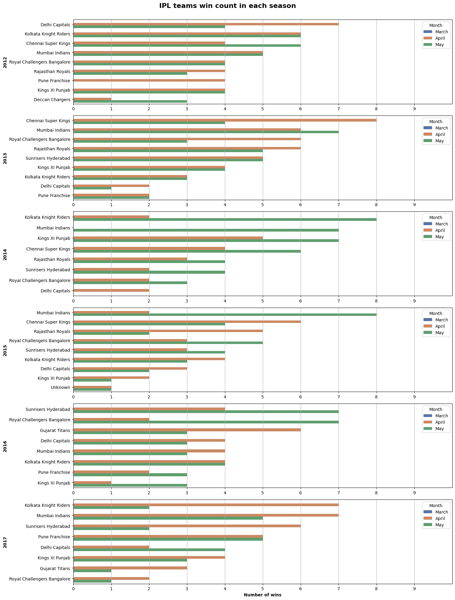

# IPL Match Analysis and Outcome Insights

## Introduction
This project performs an exploratory and predictive analysis of Indian Premier League (IPL) match data to understand team performance, match outcomes, toss impact, venue influence, and season-wise trends. Using structured data analysis and visualization, the project aims to extract meaningful insights from historical IPL matches and identify patterns that influence winning outcomes.

---

## Dataset
The dataset used in this project consists of structured IPL match-level data, where each row represents a single match. It includes categorical and numerical attributes describing teams, match conditions, and results.

**Dataset characteristics:**
- Match-level historical IPL data
- Multiple seasons covered
- Structured tabular format

**Key columns and data types:**
- `season` (numerical): IPL season year  
- `team1`, `team2` (categorical): Competing teams  
- `winner` (categorical): Match-winning team  
- `toss_winner` (categorical): Team that won the toss  
- `toss_decision` (categorical): Bat or field decision  
- `venue` (categorical): Match venue  
- `result` (categorical): Match result type  
- `win_by_runs`, `win_by_wickets` (numerical): Margin of victory  

---

## Data Cleaning
To ensure consistency and accuracy, the following preprocessing tasks were performed:

- Removed duplicate match records  
- Handled missing or inconsistent values in result-related columns  
- Standardized team names across seasons  
- Converted season and margin columns into numerical formats  
- Filtered abandoned or no-result matches where necessary  
- Validated categorical values for toss decisions and venues  

These steps ensured the dataset was reliable for analysis and visualization.

---

## Data Visualization and Analysis

### Matches Played per Season

The chart shows variation in the number of matches played across IPL seasons, reflecting changes in tournament structure such as the introduction of new teams or format adjustments. Seasons with higher match counts indicate expanded participation, while lower counts correspond to shortened seasons, highlighting how league structure directly impacts match volume.

---

### Team-wise Match Wins

This visualization highlights that a small group of teams consistently dominate match wins across seasons. Traditional franchises such as Mumbai Indians and Chennai Super Kings appear prominently, indicating sustained performance over time. The disparity between top-performing teams and lower-ranked teams suggests long-term competitive imbalance within the league.

---

### Toss Decision Impact

The chart indicates that teams winning the toss show a clear preference toward a particular decision, with fielding chosen more frequently than batting. This reflects strategic adaptation to pitch conditions and match dynamics, particularly in limited-overs cricket where chasing has often been perceived as advantageous.

---

### Toss Winner vs Match Winner

This visualization shows that winning the toss does not guarantee winning the match, as the proportion of matches won by toss-winning teams is not overwhelmingly dominant. While the toss provides a strategic advantage, overall team performance and execution remain the primary determinants of match outcomes.

---

### Venue-wise Match Distribution

The chart illustrates that certain venues host a significantly higher number of matches, indicating their importance as recurring IPL locations. These venues often become strongholds where teams adapt strategies based on pitch behavior, crowd support, and historical performance trends.

---

### Winning Margin Analysis

This visualization reveals a wide distribution of winning margins by runs and wickets. Close finishes are common, emphasizing the competitive nature of the IPL, while occasional large-margin victories indicate mismatches or dominant performances in specific matches.

---

### Season-wise Performance Trends

The chart shows fluctuations in team performance across seasons, with some teams maintaining consistency while others experience sharp rises or declines. This reflects the impact of auctions, team composition changes, and leadership decisions on season outcomes.

---

### Match Outcome Distribution

This visualization indicates that most matches conclude with clear winners, while a smaller proportion result in no-results or special outcomes. This reinforces the reliability of the dataset for performance-based analysis and highlights the league’s overall competitive stability.

---

## Prediction Based on Observed Trends
Based on observed trends, teams with historically consistent performance and strong venue adaptability are more likely to sustain success in future seasons. Toss decisions will continue to influence match strategy but are unlikely to outweigh team quality and in-game execution. Additionally, teams that adapt effectively to seasonal changes and optimize squad composition are predicted to outperform those with inconsistent strategies.

---

## Conclusion
This project demonstrates how IPL match data can be systematically analyzed to uncover performance patterns, strategic trends, and outcome determinants. The analysis highlights the dominance of consistent teams, the limited but notable influence of toss decisions, and the importance of venue and season dynamics. Overall, the project shows how data-driven insights can enhance understanding of competitive sports tournaments like the IPL.

---

## Author
**Pritika Mediboina**  
Data Analytics | Python | SQL | Data Visualization

